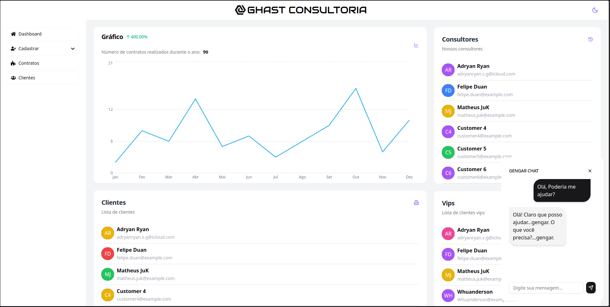
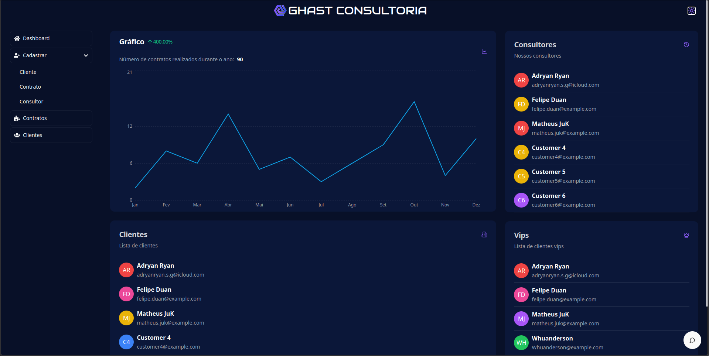
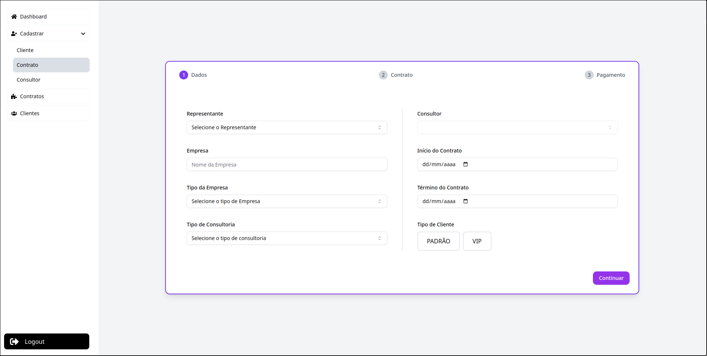
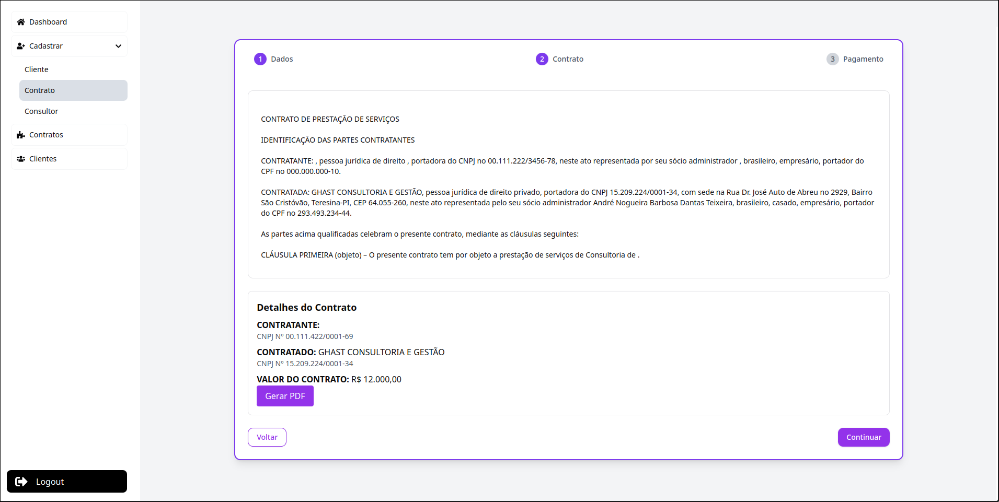
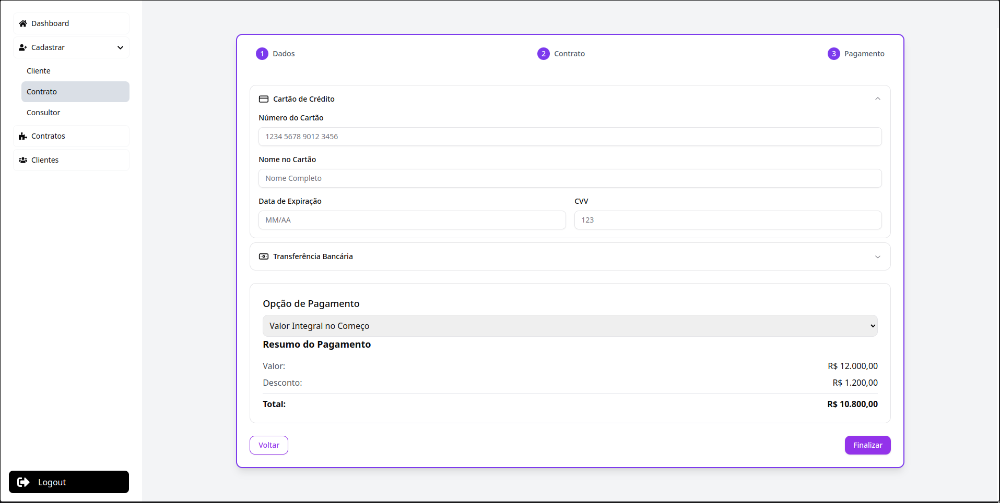
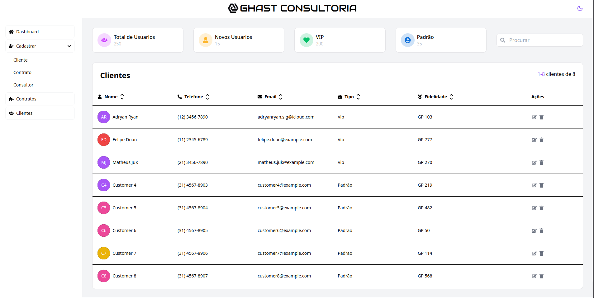

# Sistema de Gestão de Consultoria: Projeto GHAST

<table>
  <tr>
    <td width="250">
      
    </td>
    <td>
      <strong>GHAST</strong> - O Sistema de Gestão de Consultoria foi desenvolvido para gerenciar e automatizar as operações de uma empresa de consultoria especializada em planejamento financeiro, gestão empresarial e análise de dados. A solução permite o cadastro e controle de clientes, consultores, contratos, projetos, faturamento, além de implementar um programa de fidelidade para a retenção de clientes.
    </td>
  </tr>
</table>

## Descrição

Este sistema oferece um atendimento diferenciado para **clientes VIP**, com recursos como **atendimento prioritário**, **descontos exclusivos** e **relatórios personalizados**. A organização dos projetos é realizada por **etapas**, e cada uma possui um **status atualizado** constantemente, gerando **relatórios periódicos de desempenho**.

## Imagens

Aqui estão algumas capturas de tela do sistema para ilustrar as funcionalidades:

### Tela de Login

### Dashboard Claro

### Dashboard Escuro

### Cadastro de Contratos

### Tela de Clientes

## Funcionalidades

### 1. Cadastro de Clientes, Consultores e Contratos

- **Registro de Clientes**: Cadastro de clientes com detalhes como categoria (**Regular** ou **VIP**) e histórico de contratos.
- **Cadastro de Consultores**: Consultores são registrados com especializações (**financeiro**, **gestão**, **TI**) e alocação automática a projetos.
- **Gestão de Contratos**: Controle de contratos com prazos e cláusulas especiais para clientes VIP.

### 2. Gerenciamento de Projetos e Etapas

- **Divisão de Projetos**: Cada projeto é dividido em etapas, como **análise**, **implementação** e **revisão**.
- **Controle de Status**: Acompanhamento de status e prazos de cada etapa.
- **Notificações e Atualizações**: Atualização contínua do progresso do projeto com notificações ao cliente.

### 3. Relatórios e Desempenho

- **Relatórios Periódicos**: Emissão de relatórios com insights do andamento das etapas.
- **Relatórios VIP**: Relatórios personalizados para clientes VIP com recomendações adicionais.
- **Exportação**: Exportação de relatórios em **PDF** e outros formatos.

### 4. Pagamentos e Faturamento

- **Faturamento por Etapa ou Entrega**: Controle de faturamento conforme o progresso ou entrega final.
- **Descontos VIP**: Aplicação automática de descontos para clientes VIP.
- **Gestão de Condições de Pagamento**: Gerenciamento de parcelas, atrasos e condições especiais de pagamento.

### 5. Programa de Fidelidade

- **Acúmulo de Pontos**: Clientes recorrentes acumulam pontos que podem ser trocados por descontos.
- **Histórico de Projetos**: Histórico com recomendações de novos serviços.

### Desenvolvedores

<table>
  <tr>
    <td align="center"><a href="https://github.com/Adryanrr"> <b>Adryan Ryan</b></a></td>
    <td align="center"><a href="https://github.com/FelipeDuan"> <b>Felipe Duan</b></a></td>
    <td align="center"><a href="https://github.com/Whuanderson"> <b>Whuanderson</b></a></td>
    <td align="center"><a href="https://github.com/MatheusJuK"> <b>MatheusJuK</b></a></td>
    <td align="center"><a href="https://github.com/AndreNTeixeira"> <b>AndreNTeixeira</b></a></td>
    <td align="center"><a href="https://github.com/PabloFalc"> <b>PabloFalc</b></a></td>
  </tr>
</table>

## Licença

Este projeto está licenciado sob a licença MIT. Consulte o arquivo **LICENSE** para mais detalhes.
